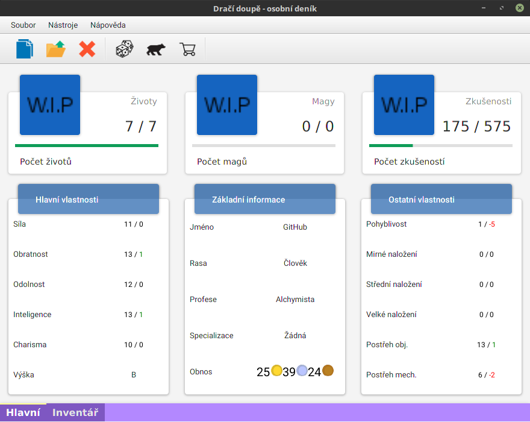

#  Správce postav pro dračí doupě

## Instalace
### Prerekvizity
Aplikace vyžaduje Javu verze 8.
Pro sestavení projektu je vyžadován Gradle.

#### Firebase
K provozování vlastní online databáze je třeba inicializovat Firebase
databázi. Po vytvoření databáze je nutné nakopírovat iniciály získané
po vytvoření do souboru _firebase_credentials.json_ který je umístěn ve
složce: `src/main/resources/other/`. V této složce se již nachází
předpřipravený soubor _firebase_credentials_default.json_, který
slouží jako příklad.

K sestavení projektu je potřeba otevřít příkazovou řádku v adresáři s projektem.
Pomocí příkazu `./gradlew jfxJar` pro Linux, případně `gradlew.bat jfxJar` pro Windows
se vytvoří spustitelný Jar soubor.

## Spuštění aplikace
Aplikaci lze spustit dvojitým poklepáním na Jar soubor. Z příkazové řádky
je lze aplikaci spustit příkazem `java -jar drd.jar`.

## Ovládání aplikace
Celé ovládání je popsané v sekci Wiki.

## Připomínky, nápady
Své připomínky a nápady sdílejte prostřednictví issue.

## Autor
- Petr Štechmüller - kompletní práce

## Licence
Tento projekt je pod licencí Apache License - více informací v
license.txt.